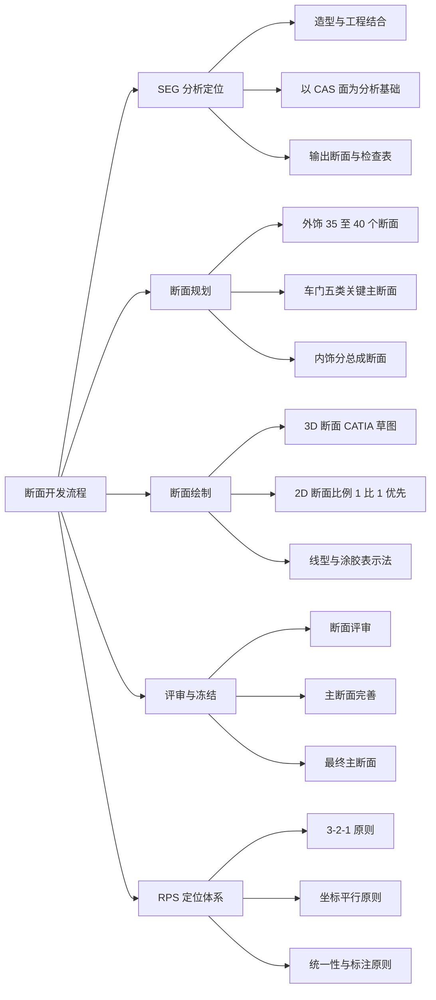
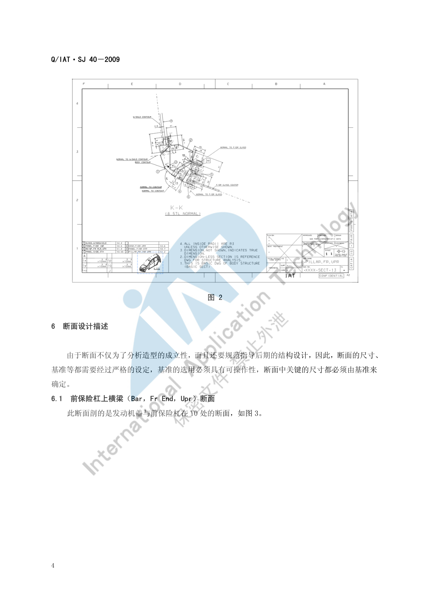
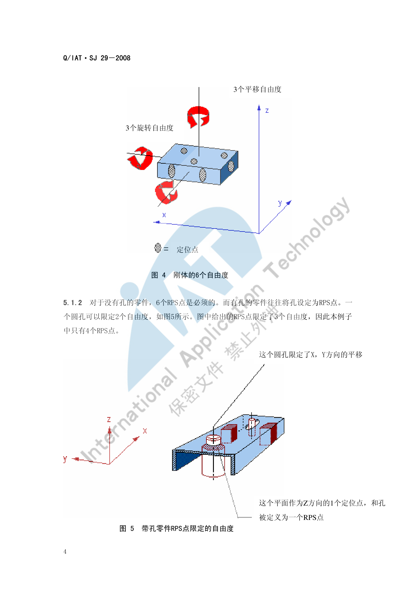

# 断面开发流程

!!! quote "内容来源"
    本页正文抽取自《总布置》知识库中**可文本解析**的文件：
    `SJ 40-2009 轿车外饰SEG分析断面设计指导书`、`SJ 45-2009 内饰SEG设计指导书`、
    `SJ 46-2009 仪表板SEG分析设计指导书`、`SJ 4-2008 轿车车门主断面设计流程`、
    `SJ 29-2008 车身RPS设计指导书`。
    企业规范编号原样保留。

## 断面开发体系

## 概述

### 要点

**（1）SEG 分析是什么**（`SJ 40-2009` §4）

SEG（**Styling Engineering Group**）分析是**造型和工程相结合**的一种分析工作，是配合造型完成造型师创意的工作。在这个阶段，**工程应该尽可能去满足造型的要求**，通过分析断面和分析数据去分析造型提供的 CAS 数据是否满足工程的要求，并将反馈意见反馈给造型部门去指导造型师进行创意设计。

- 分析的数据基础是 **CAS 面**；模型师再通过工程分析过的 CAS 面去指导**油泥模型**的制作；
- SEG 分析是**正向设计中的关键环节**，其好坏直接影响后期模型的制作进度、工程设计的进度及质量。

**（2）SEG 分析的输出物**（`SJ 40-2009` §4）

| 输出物 | 内容 |
|---|---|
| **分析断面** | 3D 与 2D 断面（本页重点） |
| **分析数据** | 主要是**开闭件的布置数据、前后轮口的校核、顶盖前后分缝线的范围**等 |
| **表面圆角间隙阶差** | 外观可见特征的定义 |
| **设计构想书** | 整体规划与总成结构规划（爆炸图形式） |
| **SEG 检查表** | 分析项的检查清单 |

**（3）内饰 SEG 的分析基准**（`SJ 45-2009` §4）

内饰 SEG 主要以**造型 CAS、外饰主断面、车身密封面、玻璃面**为分析基准，对内饰零件的**安装、工艺、法规、人机**等方面进行详细分析，以保证最终造型方案具有工程可行性，并作为各专业将来独立进行结构设计时的**控制数据**。

**（4）术语**（`SJ 40-2009` §3）

| 缩写 | 全称 | 含义 |
|---|---|---|
| WAD | Wrap Around Distance | 包络线（行人保护头部撞击基准） |
| BODY CONTOUR | — | CAS 面或油泥模型的外表面 |
| HPC | Head Position Contour | 头部包络面 |
| E.O 点 | Ergosphere Origin | 可通过大致的球面表示驾驶员手的操作范围，其中心称为 E.O 点（`SJ 45-2009` §3） |

### 示例

断面分布图是整份断面交付物的"目录"，要求模板统一并体现**断面分布位置与命名**：

### 注意事项

- **SEG 阶段的立场是"满足造型"而非"限制造型"**：`SJ 40-2009` 明确"在这个阶段工程应该尽可能的去满足造型的要求"——工程的职责是**给出可行边界并反馈**，而不是直接否决造型；
- **SEG 与总布置不是同一件事**：SEG 以**造型 CAS** 为对象（几何可行性），总布置以**硬点与目标值**为对象（性能与法规），二者互为输入。

## 断面规划

### 要点

**（1）断面数量**（`SJ 40-2009` §5、`SJ 46-2009` §5）

| 部位 | 断面数量 | 适用车型 |
|---|---|---|
| **外饰 SEG** | 大致 **35 到 40 个** | M1 类（不适用于 M2、N1） |
| **仪表板 SEG** | 大致 **30 个**（可按实际增减） | 乘用车与商用车仪表板正向设计 |
| **车门主断面** | 按清单定义（`SJ 4-2008` 要求先定义**数量、位置与方位**） | 乘用车闭合件（含前后车门、侧拉门、后背门、前机盖、行李箱） |

**（2）断面清单的制定要求**（`SJ 4-2008` §3）

在进行车门主断面详细设计前：

1. **必须先定义好车门主断面的数量、相应的位置与方位**，并充分定义好主断面**所要表达的内容和排列顺序**，然后形成**车门主断面清单**；
2. **必须确认各门内所装配的附件形式**，以便于主断面的制定；
3. 这些内容必须与用户进行**反复协商与讨论**，取得共同一致的意见并形成相关的技术文件，作为今后工作的依据。

**（3）断面位置的定义依据**（`SJ 40-2009`、`SJ 4-2008`、`SJ 46-2009`）

| 依据类型 | 示例 |
|---|---|
| **人机基准** | 驾驶员 H 点纵向断面（`SJ 46-2009` §6.1） |
| **接口位置** | 前保险杠与发动机盖在 Y0 处（`SJ 40-2009` §6.1）；前风窗玻璃与发动机盖在 Y0 处（§6.2） |
| **极限位置** | 过前轮轮心平行于 yz 面（含轮胎包络面）（`SJ 40-2009` §6.3） |
| **法规基准点** | WAD = 1000 mm 的点作为校核基准（`SJ 40-2009` §6.1） |
| **分缝线** | 以分缝线为基准确定包边与遮挡结构（`SJ 40-2009` §6.3） |

### 示例

车身主断面的分布图与流程：`SJ 4-2008` 明确主断面设计**始于车身油泥模型制作过程**，油泥模型初始阶段应在模型**关键位置和危险断面**提取断面数据，输入 CAD 进行结构可行性、运动干涉、装配可行性、焊接可行性、冲压可行性分析；为提高精度可采集油泥模型表面数据建立 **CLASS-B 表面模型**再分析，形成**第一版新车型主断面数据**，作为今后车门三维结构设计的依据。

### 注意事项

- **关键区域断面覆盖要求**：断面数量不是越多越好，但**人机基准、法规基准、极限位置、接口位置**四类断面必须覆盖，遗漏其中任何一类都可能导致后期返工；
- 断面清单属于**技术文件**，必须与客户确认后固化，不能边做边加。

## 断面绘制

### 要点

**（1）绘图规范**（`SJ 46-2009` §5.2、`SJ 40-2009` §5）

| 项目 | 要求 |
|---|---|
| 3D 断面 | 统一在 **CATIA 的"草图绘制器"模块**中绘制；在打开默认约束的环境下，用"**三维元素相交**"命令求得与 CAS 面或油泥模型外表面的交线，在此基础上进行**参数化草图**断面设计（优点：绘图快捷、编辑修改方便、可做运动件草图模拟分析） |
| 2D 投图比例 | **优先 1:1**，其次 **1:2、2:1**（仪表板 SEG 为 1:1 优先，其次 1:2、1:5、2:1） |
| 图幅 | 建议采用 **A2 和 A3** 两种；断面分布图和一些比较大的断面用 A2，其它统一用 A3 |
| 标题栏 | 需体现**断面在车身中的位置图、断面面积、转动惯量、断面编号、断面名称、比例大小** |
| 明细栏 | 需体现各部件的**序号、英文名称、料厚** |
| 尺寸基准 | 断面中的尺寸（特别是**关键尺寸**）**都要有基准**，或可由基准间接推算出来 |
| 技术要求 | 如有特殊安装和加工工艺要求，需给出技术要求 |
| 语言建议 | `SJ 46-2009` 建议工程师在设计中尽量采用**英文**，以与国际接轨并为外籍专家审核断面提供便利 |

**（2）线型与符号规范**（`SJ 40-2009` §5.2）

| 元素 | 规范 |
|---|---|
| 尺寸标注字体 | **SSS1**，字号 **3.5** |
| 基准线及孔中心线 | **4 号单点划线** |
| 假想示意线 | **5 号双点划线** |
| 孔的连接线 | **2 号虚线** |
| 断面线及标注 | **1 号细线** |
| 涂胶示意 | Type = **Hatching**、Angle = **45°**、Pitch = **1 mm**、Offset = **0 mm** 的阴影 |
| 断面分布图断面代号 | **SSS1** 字体，字号 **5.0 粗体** |

**（3）设计基准的通用构成**（`SJ 46-2009` §6）

每个断面的设计基准通常包括：**坐标平面**、**CAS 面即油泥模型的外表面（BODY CONTOUR）**、**各件分缝线**，再加该断面的专项基准（如人体、组合仪表、转向管柱、方向盘布置等）。

### 示例

断面图的标题栏与明细栏需同时承载"几何信息 + 结构信息 + 性能信息"（断面面积与转动惯量）：

### 注意事项

- **断面与三维数据的一致性维护**：`SJ 4-2008` §3 描述了二者的迭代关系——以主断面为依据进行三维结构设计的过程中，会发现结构不合理、难以实现甚至无法实现的问题，**反过来就要修改断面数据**；通过反复修改主断面设计与三维结构设计的相互关系，才能形成最终主断面；
- 断面之所以要求"关键尺寸由基准确定"，是为了**让下游结构设计可以直接引用**，而不是每次重算——基准的选用"必须具有可操作性"。

## 评审与冻结

### 要点

**（1）主断面的评审流程**（`SJ 4-2008` §3 图 1）

标准流程为：**标杆样车主断面分析 → 新车型油泥模型 → 油泥模型测量 → 车身外形粗略数模 → 新车型主断面 → 新车型主断面评审（评审报告）→ 车身三维结构设计与修改 → 三维结构设计评审（评审报告）→ 最终三维结构设计数模 → 主断面完善 → 最终主断面**。两个评审环节都为"合格 / 不合格"判断，不合格则回到设计修改。

**（2）标杆样车的前置分析**（`SJ 4-2008` §3）

为使主断面与结构设计更顺利可靠，一般**先对标杆样车进行逆向建模**（三维数模与二维主断面），并保证**标杆样车与新车型主断面的位置协调一致**。在此基础上对标杆样车做：

| 分析类型 | 内容 |
|---|---|
| 刚度分析 | 整体扭转/弯曲刚度、车身接头部位刚度、**车门门洞部位刚度** |
| 断面参数计算 | A/B/C/D 柱断面、门槛断面、顶盖侧围断面、前后风挡断面的**封闭面积、材料面积、转动惯量系数** |
| 碰撞 CAE | 正碰、侧碰、追尾碰撞、低速正碰、翻滚压顶 |

> 据计算结果可判断标杆样车的刚度分布状况，找出**刚度过剩与不足的部位**：新车型设计时对原车**刚度不足处加强、过剩处削弱**，使新设计车身具有良好刚度分布。同理，依据标杆样车的碰撞 CAE 结果指导新车型的车身主断面和结构设计。

**（3）冻结后的变更**

断面冻结后若发生变更，需回到流程中对应环节重新评审；`SJ 46-2009` §5 要求"统一 2D 断面的模板、投图比例及标注尺寸的大小和规范"，属于变更管理的基础。

### 示例

`SJ 4-2008` 的主断面流程图明确了"两次评审、两次回溯"的结构——**主断面评审**与**三维结构设计评审**互为闭环，任何一侧不合格都要回到上一环节。

### 注意事项

- **冻结后变更的处理**：已解析条款强调断面与三维结构设计的**迭代关系**，但**未给出断面冻结后的正式变更流程**（如变更申请、影响评估），属待人工补充项；
- **评审报告是交付物**：`SJ 4-2008` 图 1 明确把"评审报告"列为流程输出，因此评审必须有**书面结论**而非口头确认。

## RPS 定位体系

### 要点

**（1）RPS 系统是什么**（`SJ 29-2008` §3.1、§2）

**RPS（Reference Points System）**是规定一些**从开发到制造、检测，直到批量装车各个环节，所有涉及的人员共同遵循的定位点及公差要求**。其目的是**有效控制因定位系统产生的公差，保证零部件尺寸精度，实现整车装配高品质**。

**（2）RPS 的三大作用**（`SJ 29-2008` §4）

| 作用 | 说明 |
|---|---|
| **减小零件的加工公差** | 基准点的变换会造成零件尺寸制造误差加大；采用同一个基准点加工，能保证制造误差最小 |
| **避免了模板的使用** | 模板使用局限性大且增加加工时间；规定工装用 RPS 点调准后，加工变成"直接的" |
| **RPS 点是模具、工装、检具的定位点** | 必须保证模具、工装、检测工具都按照 RPS 点来制造 |

**（3）五大原则**（`SJ 29-2008` §5）

| 原则 | 内容 |
|---|---|
| **3-2-1 原则** | 刚体有 6 个自由度（3 平移 + 3 旋转），需 **3 个 Z 向 + 2 个 Y 向 + 1 个 X 向**共 6 个定位点 |
| **坐标平行原则** | 测量和加工时零件放置必须保证能获得精确结果 |
| **统一性原则** | 各部门不得自作主张随意确定基准点 |
| **尺寸标注原则** | 按名义尺寸在零件坐标系中标注 |
| **RPS 尺寸图** | 以图面形式固化 RPS 点与公差 |

**（4）RPS 点标注规则**（§5.1.3）

| 字母 | 含义 |
|---|---|
| **H, h** | 孔 / 销定位 |
| **F, f** | 平面 / 棱边 / 球面 / 顶点定位 |
| **T, t** | 理论点 |
| **大写** | 主 RPS 点的定位方式 |
| **小写** | 附加定位点的定位方式 |
| **x, y, z** | RPS 点的限位方向 |

**（5）例外情形**（§5.1.5）

3-2-1 规则适用于任何形状的零件，但特殊形状刚体会产生例外：**球体只需 3 个定位点**（旋转对轮廓没有改变）；**旋转体需要 5 个定位点**（绕中心轴旋转外形不变）；**铰接零件需要多于 6 个定位点**（将其中一个设为固定件进行 RPS 设定，另外的铰接件根据需要增加附加定位点）。此外，**大面积刚度不足的零件**在保障 3-2-1 前提下还需**附加定位点**保证平衡状态。

### 示例

3-2-1 原则的物理含义是"用最少定位点锁死 6 个自由度"：

基准固定与否对公差的影响可直接量化：以孔 A 为基准钻 B、D，再以 D 为基准钻 C 时，**B 与 C 的距离公差为 ±0.3**；若始终以孔 A 为基准钻 C，则 **B 与 C 的公差为 ±0.2**——**基准固定可减小 ±0.1 mm**。

### 注意事项

- **RPS 是"跨环节公约"**：它约束的不只是设计，还包括模具、工装、检具——因此 RPS 点应**尽可能早地与所有参与设计、模具开发、生产、检验等过程的部门商定**（`SJ 19-2008` §3.8 也有同样要求）；
- **RPS 点须定位在零件的稳定部位**，这些部位即使在后续开发生产过程中也不会发生变化；若零件提不出特征孔，必须选择**平面或棱边**作为 RPS 点。

## 待人工补充

!!! warning "本页待人工补充清单"
    - **断面冻结后的正式变更流程**（变更申请、影响评估、审批）；
    - **断面评审的判据清单**：本页仅有"合格/不合格"的流程描述，未见具体评审检查项；
    - `SJ 40-2009` 共 47 页，本页仅解析了 §6.1～§6.3 三个断面的设计方法，其余约 32 个断面的
      具体设计思路尚未逐项提取（**建议作为下一轮重点**，它是"典型断面清单"页的主要来源）；
    - `SJ 45-2009` 共 25 页，本页仅解析了流程与 A 柱上饰板示例；
    - `SJ 29-2008` 的"坐标平行原则""统一性原则""尺寸标注原则""RPS 尺寸图"四项原则的详细
      示例（§5.2～§5.5）与"车身 RPS 点布置实例"尚未展开；
    - 知识库中以下文件虽相关但因读取问题**未采用**：`AEM-A0-010 整车坐标系建立规范与流程`、
      `AEM-A0-203 造型用总布置图制作`、`AEM-A0-200 总布置图绘制规范`、
      `40《总布置图设计规范》.xlsx`（该文件为 Excel，未解析）。

    建议：在 IMA 客户端中打开对应文件补充条款，或按"规范编号 + 页码"方式人工引用。

---

## 下一步阅读

- [断面设计方法](method.md)：线型规范、典型位置选取与断面驱动设计
- [典型断面清单](library.md)：前端/乘员区/后端关键断面清单
- [IP 布置](../ip-cnsl/ip.md)：仪表板 SEG 断面的设计思路（§6.1～6.17）
- [门板布置](../door-trim/door.md)：车门五类关键主断面
