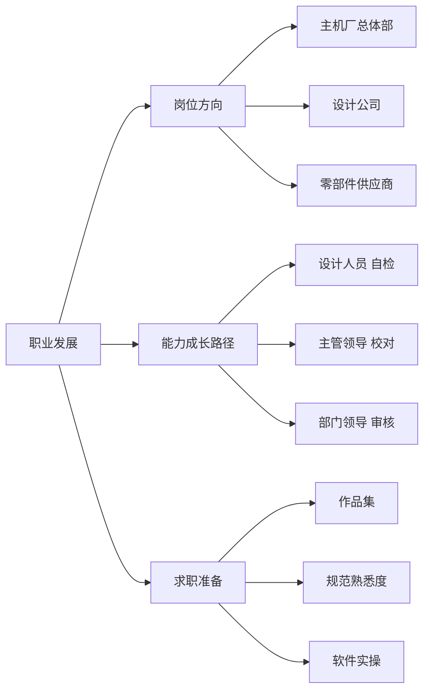

# 职业发展

!!! quote "内容来源"
    本页正文参考了《总布置》知识库中**可文本解析**的文件（用于反推岗位与能力要求）：
    `SJ 2/6/7/9/15/16/29/40/41/45/46/54` 各规范的**起草单位与责任人分工**、
    `SJ 41-2009 动力/底盘3D数据评审流程`（三级签字与角色分工）、
    `SJ 45-2009 内饰SEG设计指导书`（SEG 文件体系与工作内容）、
    `40《总布置图设计规范》`（数据责任人与检查责任）。
    **知识库中没有职业发展类专门条款，本页仅基于上述事实性材料做客观归纳，其余部分明确标注为待补充。**

## 职业发展框架



## 概述

### 要点

知识库中**没有**职业发展的专门规范，但通过各规范的**起草单位、起草人、责任人分工**可以客观反推三类信息：

| 反推信息 | 依据 |
|---|---|
| **组织架构与专业分工** | 每份 SJ 规范的"起草单位"（总体设计部 / 白车身设计部 / 装饰件设计部 / 开闭件设计部 / 电气设计部 / 技术管理部） |
| **能力分级** | `SJ 41-2009` §3.2 的自检表三级签字：**设计人员自检 → 主管领导校对 → 部门领导审核**；`40` 的参数表三级签署：自检 / 校对 / 审核 |
| **工作内容** | `SJ 2-2008` §4.2～4.5 的各阶段工作内容；`SJ 41-2009` §5 的 7 类评审准备文件填写责任人 |

### 示例

从规范的起草单位分布可以看出**上车体总布置横跨多个部门**（以知识库中 54 份 SJ 规范为例）：

| 部门 | 规范数量（示例） | 典型规范 |
|---|---|---|
| 总体设计部 | 7+ | `SJ 6 人机硬点`、`SJ 7 前方视野`、`SJ 9 眼椭球`、`SJ 15 手伸及界面`、`SJ 16 样车测量` |
| 装饰件设计部 | 11+ | `SJ 18 顶篷`、`SJ 19 空气室盖板`、`SJ 20 立柱内饰板`、`SJ 21 前门内饰板`、`SJ 24 前后保险杠`、`SJ 45～50 内饰/仪表板系列` |
| 白车身设计部 | 4+ | `SJ 28 白车身2D图纸`、`SJ 29 车身RPS`、`SJ 40 外饰SEG断面`、`SJ 54 侧碰B柱断面系数` |
| 开闭件设计部 | 4+ | `SJ 2 车门设计`、`SJ 3 车门检查`、`SJ 4 车门主断面`、`SJ 53 行李箱盖扭簧` |
| 电气设计部 | 2+ | `SJ 32 倒车雷达`、`SJ 39 操纵件标志法规校核` |
| 技术管理部 | 全部 | 各规范统一"由技术管理部归口管理" |

### 注意事项

- **本页的大部分内容属于知识库的知识缺口**：职业路径、薪酬、认证等信息在《总布置》知识库中不存在，
  不应臆测填充；
- 本页的价值在于**用规范事实反推岗位能力要求**，而不是提供职业规划建议。

## 岗位方向

### 要点

从知识库可确认的岗位方向有三类，其差异体现在**工作产物的形态**上：

| 方向 | 典型产物（知识库证据） | 能力侧重 |
|---|---|---|
| **主机厂（OEM）总体部** | 硬点报告、总布置图、参数目标表（`40` 的"数据责任人 + 检查责任"） | 约束定义能力、跨专业协调、门禁把控 |
| **设计公司 / 工程服务** | 设计指导书、校核规范、SEG 断面、检查清单（本知识库的 SJ/QCD/EDD 体系即由此类企业编制） | **方法与规范的产出能力**、多项目并行、快速交付 |
| **零部件供应商** | 零件内部结构（`SJ 47-2009` §6.3 明确"烟灰缸……**内部结构一般供应商设计**"）、结构设计数据 | 结构设计与工艺实现 |

**（1）主机厂总体部**

- 产物以**约束**为主：硬点、断面、参数目标、检查清单；
- 需要覆盖 `QCD-A0-005/006` 的全部门禁判据，并对造型与各专业输出边界。

**（2）设计公司**

- 产物以**方法与规范**为主：本知识库中的 54 份 SJ 规范、QCD 检查规范、EDD 检查清单即此类企业的核心资产；
- 从规范结构可见其工作方式：**表格式清单 + 逐阶段打勾 + 三级签字 + 评审整改闭环**。

**（3）供应商**

- 产物以**零件内部结构**为主；
- 边界清晰：主机厂/设计公司给"零件边界与配接关系"，供应商做"零件内部结构"。

### 示例

岗位职责示例（从 `SJ 41-2009` 的填写责任人反推）：

| 角色 | 职责 |
|---|---|
| **系统负责人** | 填写 3D 数据自检表、系统配接单；对本人系统数据的完整性与正确性负责 |
| **性能控制科室责任人** | 编制管线布置校核报告、动态检查报告；填写整改开闭项清单并**跟踪整改是否完成** |
| **项目负责人** | 汇总备案全部文件、编制评审报告 PPT、填写评审申请表、主持评审 |
| **评审专家** | 提出评审问题（由专人记录并形成《评审报告》） |

### 注意事项

- **不同方向的能力侧重**：主机厂更强调**跨专业协调与流程把控**，
  设计公司更强调**规范产出与方法沉淀**，供应商更强调**结构设计与工艺**——三者的知识结构差异明显；
- **知识库中的规范体系本身是设计公司能力的证据**：54 份 SJ 规范 + QCD + EDD 构成了一套完整的
  "设计方法 + 检查清单 + 流程"资产，这是设计公司相比单一项目经验更难替代的积累。

## 能力成长路径

### 要点

知识库中**没有**能力分级的规定，但**三级签字制度**提供了明确的参照系：

| 层级 | 角色 | 职责要求（从制度反推） |
|---|---|---|
| **第 1 级** | **设计人员（自检）** | 能按规定的项目对 3D 数据进行检查；掌握软件操作、断面绘制、尺寸标注规范；能填写自检表与配接单 |
| **第 2 级** | **主管领导（校对）** | 能发现自检遗漏；掌握本系统的判据体系（如间隙表、法规项）；能判断数据是否达到交付状态 |
| **第 3 级** | **部门领导（审核）** | 能对整体方案的合理性与风险做判断；掌握跨专业接口与法规风险；对交付结果负责 |

**能力项按"五步设计顺序"映射**（`SJ 18/19/20/21/50` 等多份规范统一采用）：

| 步骤 | 对应能力 | 典型工具/依据 |
|---|---|---|
| **查定义** | **输入确认能力**：配置表、法规要求、性能目标是否定稿 | 配置表、`EDD` 检查清单 |
| **做边界** | **几何构建能力**：断面、边界线、基准 | CATIA、`SJ 40/46` |
| **核人机** | **人机与法规能力**：眼椭球、头部包络面、手伸及界面、视野 | `SJ 6/7/9/15`、Ramsis |
| **定结构** | **结构方案能力**：安装点、定位点、卡接结构、工艺可行性 | `SJ 29` RPS、各分系统指导书 |
| **细化 3D** | **数据交付能力**：2D 投图、明细表、三级签字、评审准备 | `SJ 41`、`40` |

### 示例

成长路径图示例（按"能独立完成的交付物"划分）：

```
自检级 ──→ 校对级 ──→ 审核级
  │            │            │
  ├ 能画断面   ├ 能定判据   ├ 能定边界
  ├ 能填自检表 ├ 能编校核报告├ 能主持评审
  └ 能读规范   └ 能写方案    └ 能控门禁
```

### 注意事项

- **瓶颈期的突破方法属待人工补充项**：知识库中没有任何关于能力瓶颈或成长方法的论述；
- **"查定义"是最容易被低估的能力**：多份规范把它列为第一步——
  它要求工程师主动确认上游是否定稿并**主动提出问题**，而不是被动等待输入。

## 求职准备

!!! warning "待人工补充：知识库中未检索到对应内容"
    已检索关键词：`简历`、`面试`、`作品集`、`应届`、`求职`、`职业规划`
    （覆盖 SJ 全系列 54 份、GM 系列 48 份、QCD/EDD 规范、H20 项目报告），均未命中。

    - **可推导的建议方向**（基于知识库中真实的交付物形态）：
      - **作品集**：总布置岗位的作品集最有说服力的是**断面与检查清单**——
        能展示"一个区域从输入到断面的完整推导链"（如按 `SJ 46-2009` 的 17 个仪表板断面做一个区域练习）；
      - **规范熟悉度**：能说清 `QCD-A0-005` 的四项平台检查、人机四件套（`SJ 6/9/15/7`）的相互关系，
        比罗列软件操作更能体现专业度；
      - **软件实操**：CATIA 参数化草图 + 三维元素相交求断面；Ramsis 假人姿态与不舒适度评价；
      - **法规意识**：能列举与上车体直接相关的强检项（`GB 11552/11551/20071/11566/4785/15741/17354`）。
    - 建议补充：目标企业的岗位说明、面试真实问题、行业招聘要求。

### 要点

- 现阶段可推导的求职准备重点只有三项：**断面作品集**、**规范熟悉度**、**软件实操**。

### 注意事项

- **应届生常见误区属待人工补充项**：知识库中无相关论述；
- 用户（知识库作者）自己的学习路径（`上车体总布置基础.md` §5.4 的八步法）本身就是一份可参考的自学方案，
  已在 [学习资源](learning.md) 中整理。

## 待人工补充

!!! warning "本页待人工补充清单"
    - **职业发展专门内容**：岗位说明、薪酬与晋升、行业认证；
    - **能力分级与成长路径的正式规定**（本页仅从三级签字制度反推）；
    - **瓶颈期的突破方法**；
    - **求职准备的具体材料**（简历模板、面试题库、作品集规范）；
    - **在线课程与行业资讯渠道**（见 [学习资源](learning.md)）；
    - **不同岗位方向的招聘要求对照**。

    说明：以上均为《总布置》知识库的**固有缺口**（库内容为设计方法与企业规范，
    不含职业发展信息），需用户自行补充或另行检索。

---

## 下一步阅读

- [学习资源](learning.md)：八步学习路径与材料清单
- [软件工具](software.md)：CATIA、Ramsis 与测量设备
- [工程师职责](../basics/responsibilities.md)：各阶段职责与能力要求
- [法规与标准](../basics/standards.md)：标准体系与编码规则
