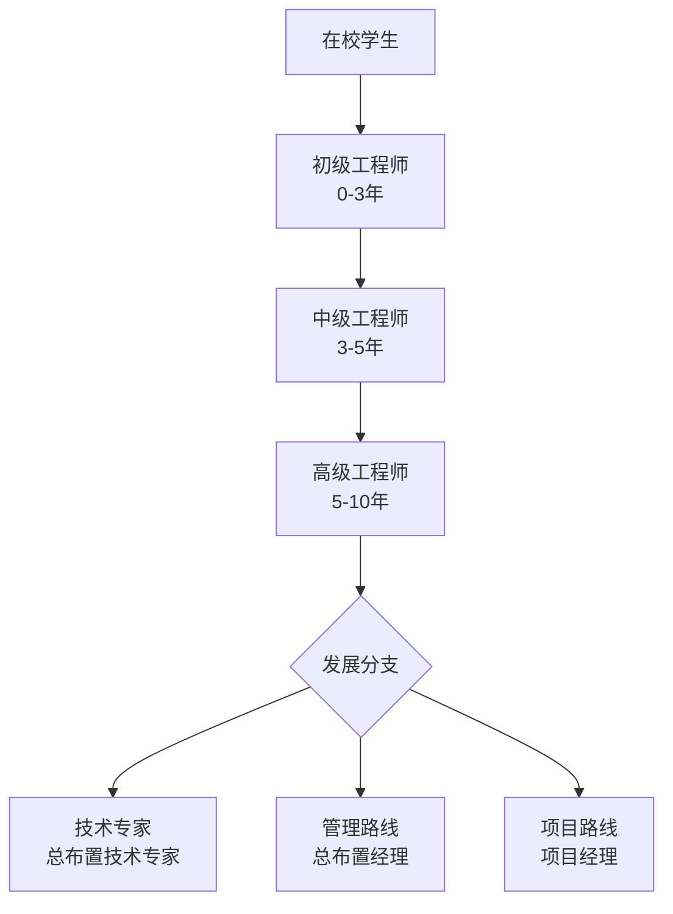
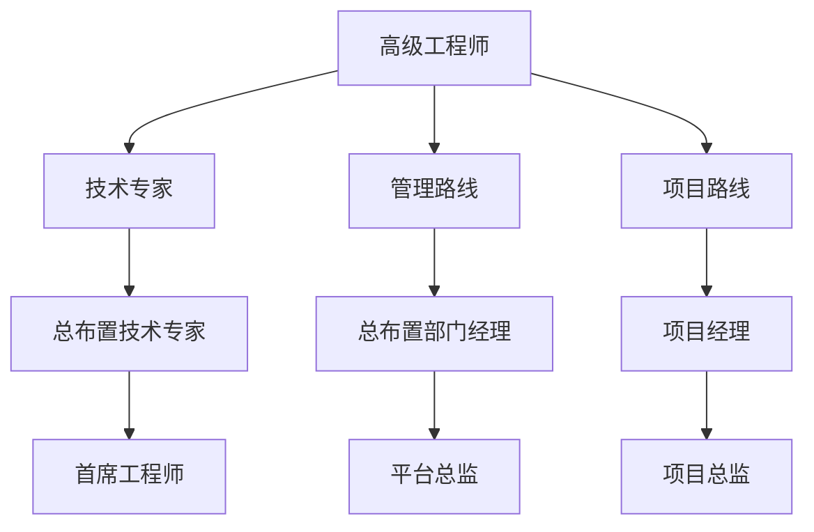
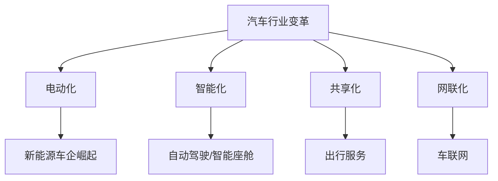
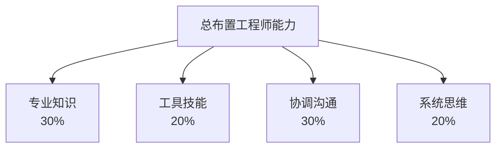
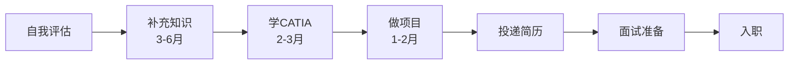
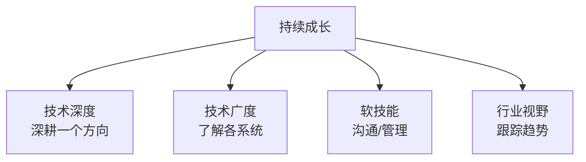

# 职业发展

## 概述

本章梳理汽车总布置工程师的职业发展路径，帮助在校学生、初入行者规划职业方向，也帮助转行者了解行业前景。

## 职业发展路径



## 各阶段详细说明

### 1. 在校学生（求职准备）

#### 目标岗位

| 岗位 | 说明 |
|------|------|
| 总布置工程师 | 整车层面布置 |
| 底盘工程师 | 底盘系统设计 |
| 动力总成工程师 | 发动机/电机布置 |
| 车身工程师 | 车身结构设计 |
| 电气工程师 | 电气系统设计 |

#### 求职准备

| 准备项 | 说明 |
|--------|------|
| 专业知识 | 汽车理论、汽车设计、汽车构造 |
| 软件技能 | CATIA（最重要）、Excel |
| 项目经验 | 毕设、竞赛（FSC/方程式） |
| 实习经历 | 主机厂/零部件实习 |
| 证书 | 英语四六级、计算机等级 |

!!! tip "方程式赛车（FSC）"
    大学生方程式赛车（FSC/FSAE）是进入汽车行业最好的实践经历。
    参与车架、悬架、总布置等，能获得宝贵的工程经验。

### 2. 初级工程师（0-3 年）

#### 主要工作

```
初级工程师日常：
├── 协助布置图维护
├── 干涉检查（DMU）
├── 参数表更新
├── 硬点表管理
├── 协助接口协调
└── 学习标准规范
```

#### 能力建设

| 能力 | 目标 |
|------|------|
| CATIA | 熟练操作，能独立完成布置图 |
| DMU | 熟练干涉检查和运动仿真 |
| 专业知识 | 理解各系统原理和接口 |
| 标准法规 | 熟悉常用标准 |
| 沟通 | 能与各系统工程师沟通 |

#### 常见困惑

| 困惑 | 建议 |
|------|------|
| "感觉都是打杂" | 打杂是学习过程，多问多看 |
| "知识太杂" | 系统化整理，建立知识框架 |
| "成长慢" | 主动承担，多总结 |
| "不知道学什么" | 参考本知识库体系 |

### 3. 中级工程师（3-5 年）

#### 主要工作

```
中级工程师日常：
├── 独立负责整车/平台总布置
├── 主导接口协调
├── 参与概念方案制定
├── 评审各系统方案
├── 指导初级工程师
└── 参与项目节点评审
```

#### 能力建设

| 能力 | 目标 |
|------|------|
| 系统思维 | 从整车角度权衡各系统 |
| 方案能力 | 能独立制定布置方案 |
| 协调能力 | 主导跨部门协调 |
| 项目管理 | 管理总布置节点 |

### 4. 高级工程师（5-10 年）

#### 主要工作

```
高级工程师日常：
├── 负责全新平台架构规划
├── 主导技术方案评审
├── 参与产品定义/战略
├── 建立设计规范
├── 技术难题攻关
└── 培养团队
```

#### 发展分支



| 路线 | 特点 | 适合人群 |
|------|------|----------|
| 技术专家 | 深耕技术，解决难题 | 技术热爱者 |
| 管理路线 | 管理团队，统筹资源 | 有管理意愿 |
| 项目路线 | 管理项目，跨部门协调 | 综合能力强 |

## 行业现状与前景

### 汽车行业变革



### 对总布置工程师的影响

| 变革 | 机遇 | 挑战 |
|------|------|------|
| 电动化 | 电池布置、电驱布置新需求 | 传统动力知识需更新 |
| 智能化 | 传感器布置、域控布置 | 电子电气知识需补充 |
| 新平台 | 滑板底盘、全新架构 | 需要创新思维 |

### 就业方向

| 方向 | 说明 |
|------|------|
| 主机厂（传统） | 一汽、上汽、东风等 |
| 主机厂（新势力） | 蔚来、小鹏、理想等 |
| 合资品牌 | 大众、丰田、宝马等 |
| 零部件 | 博世、大陆、采埃孚等 |
| 设计公司 | 阿尔特、龙创等 |
| 互联网造车 | 华为、小米等 |

## 薪资参考

> 以下为参考范围，实际以地区、企业、个人能力为准。

| 阶段 | 年薪范围（一线城市） |
|------|---------------------|
| 应届生 | 10-18 万 |
| 初级（0-3年） | 15-25 万 |
| 中级（3-5年） | 25-40 万 |
| 高级（5-10年） | 40-70 万 |
| 专家/管理（10年+） | 60-150 万+ |

!!! note "新能源溢价"
    新能源车企薪资普遍高于传统车企 20-50%，
    但工作强度也更大。

## 核心能力模型



| 能力 | 权重 | 说明 |
|------|------|------|
| 专业知识 | 30% | 整车+各系统知识 |
| 工具技能 | 20% | CATIA/DMU/Excel/Python |
| 协调沟通 | 30% | 核心能力，跨部门协调 |
| 系统思维 | 20% | 全局观、权衡能力 |

!!! tip "协调沟通最重要"
    总布置工程师 60-70% 的时间在沟通协调。
    技术是基础，沟通是核心竞争力。

## 转行建议

### 适合转行的人群

| 背景 | 优势 | 需补充 |
|------|------|--------|
| 机械工程 | 建模基础 | 汽车知识 |
| 车辆工程 | 专业对口 | - |
| 动力工程 | 动力系统 | 整车知识 |
| 电气工程 | 电气知识 | 机械/汽车 |

### 转行路径



| 步骤 | 时间 | 重点 |
|------|------|------|
| 1. 自我评估 | 1 周 | 分析优势和不足 |
| 2. 补充知识 | 3-6 月 | 汽车构造、总布置基础 |
| 3. 学 CATIA | 2-3 月 | 达到基本操作水平 |
| 4. 做项目 | 1-2 月 | 临摹布置方案 |
| 5. 求职 | - | 突出学习能力和相关经验 |

## 面试准备

### 常见面试问题

| 类型 | 问题示例 |
|------|----------|
| 基础知识 | 汽车有哪些主要系统？ |
| 总布置 | FF 和 FR 的区别？ |
| 参数 | 轴荷分配对操稳的影响？ |
| 系统 | 麦弗逊和多连杆的区别？ |
| 法规 | 你了解哪些汽车法规？ |
| 工具 | CATIA 怎么做干涉检查？ |
| 开放题 | 如何解决两个系统的空间冲突？ |

### 面试建议

| 建议 | 说明 |
|------|------|
| 理解而非背诵 | 面试官看重理解深度 |
| 结合案例 | 用实际案例说明 |
| 承认不会 | 不懂就说不懂，诚实加分 |
| 展示思考 | 展示分析问题的思路 |
| 问好问题 | 展示对岗位的兴趣 |

## 持续成长建议



| 维度 | 方法 |
|------|------|
| 技术深度 | 参与项目、解决难题 |
| 技术广度 | 本知识库 + 跨系统学习 |
| 软技能 | 主动承担协调工作 |
| 行业视野 | 关注新车型、新技术 |

!!! success "成长心法"
    1. **多实践**：纸上得来终觉浅
    2. **多总结**：经验需要提炼
    3. **多分享**：教是最好的学
    4. **多看车**：实践出真知
    5. **建体系**：知识需要框架

---

## 下一步阅读

- [软件工具](software.md）：必备工具
- [学习资源](learning.md）：学习材料
- [工程师职责](../basics/responsibilities.md）：岗位理解
