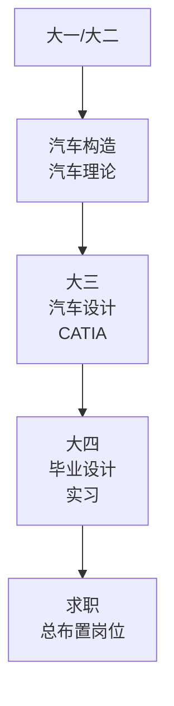
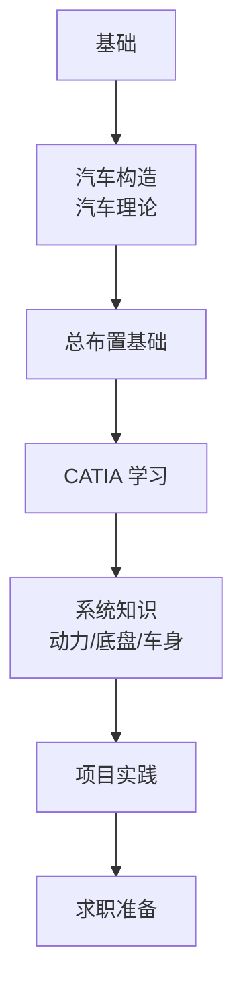
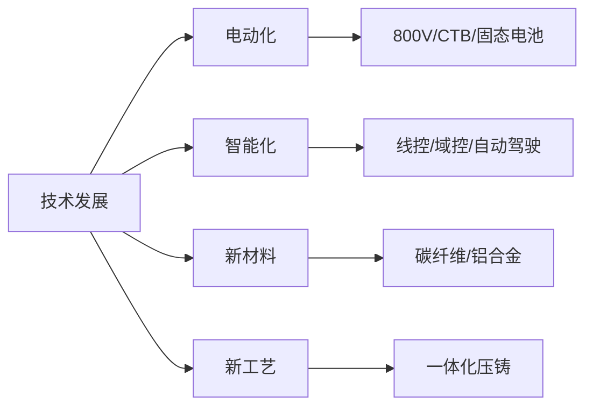

# 学习资源

## 概述

本章整理汽车总布置相关的学习资源，包括书籍、课程、标准、网站和社区，帮助系统学习和持续提升。

## 书籍推荐

### 总布置与整车设计

| 书名 | 作者/出版社 | 说明 |
|------|-------------|------|
| 《汽车总体设计》 | 余志生 | 经典教材，总布置入门必读 |
| 《汽车设计》 | 陈家瑞 | 汽车设计综合教材 |
| 《汽车工程手册》 | 中国汽车工程学会 | 权威工具书 |
| 《Automotive Engineering》 | Peter M. B. et al. | 英文综合教材 |
| 《汽车总布置设计》 | 内部教材/培训资料 | 部分企业有内部教材 |

### 各系统设计

| 方向 | 书名 | 说明 |
|------|------|------|
| 动力总成 | 《汽车发动机原理》 | 发动机基础 |
| 底盘 | 《汽车底盘设计》 | 底盘系统设计 |
| 悬架 | 《汽车悬架设计》 | 悬架专题 |
| 转向 | 《汽车转向系统设计》 | 转向专题 |
| 制动 | 《汽车制动系统设计》 | 制动专题 |
| 车身 | 《汽车车身设计》 | 车身结构 |
| 人机 | 《汽车人机工程学》 | 人机工程 |
| NVH | 《汽车NVH技术》 | 噪声振动 |

### 电动车专题

| 书名 | 说明 |
|------|------|
| 《电动汽车工程学》 | 电动车综合 |
| 《电动汽车动力电池系统》 | 电池系统 |
| 《电动汽车驱动电机》 | 驱动电机 |
| 《新能源汽车热管理》 | 热管理 |

### 标准与法规

| 资源 | 说明 |
|------|------|
| GB / GB/T 标准 | 国家标准（全国标准信息平台免费查询） |
| QC/T 标准 | 汽车行业标准 |
| SAE 标准 | 美国汽车工程师学会标准 |
| ISO 标准 | 国际标准 |
| ECE 法规 | 欧洲法规 |

!!! tip "标准查询"
    - 中国标准：[全国标准信息公共服务平台](https://std.samr.gov.cn/)
    - 强制性国标全文可免费阅读

## 课程资源

### 大学课程

| 课程 | 说明 |
|------|------|
| 汽车理论 | 汽车性能基础 |
| 汽车设计 | 整车与零部件设计 |
| 汽车构造 | 汽车结构认知 |
| 汽车人机工程 | 人机分析 |
| 车辆动力学 | 操稳/平顺分析 |
| 新能源汽车 | 电动化技术 |

### 在线课程

| 平台 | 课程方向 |
|------|----------|
| 中国大学 MOOC | 汽车相关公开课 |
| 学堂在线 | 清华等高校课程 |
| Coursera | 国际高校课程 |
| B站 | 汽车知识 UP 主 |

### 企业培训

| 类型 | 说明 |
|------|------|
| 入职培训 | 主机厂校招入职培训 |
| CATIA 培训 | 软件操作培训 |
| 内部技术分享 | 各部门技术交流 |
| 供应商培训 | 零部件供应商技术介绍 |

## 网站与社区

### 专业网站

| 网站 | 说明 |
|------|------|
| [汽车工程师之家](http://www.autoengineer.org/) | 汽车工程师社区 |
| [盖世汽车](https://auto.gasgoo.com/) | 汽车行业资讯 |
| [汽车之家技术](https://www.autohome.com.cn/) | 车型数据库 |
| [SAE International](https://www.sae.org/) | 国际汽车工程师学会 |

### 技术社区

| 社区 | 说明 |
|------|------|
| 知乎汽车话题 | 技术讨论 |
| CATIA 论坛 | 软件交流 |
| 汽车设计师论坛 | 设计交流 |

### 资讯平台

| 平台 | 说明 |
|------|------|
| 汽车之家 | 行业资讯 |
| 懂车帝 | 车型数据 |
| 车云网 | 智能网联 |

## 行业报告

| 报告 | 来源 | 说明 |
|------|------|------|
| 中国汽车工业年鉴 | 中汽协 | 行业数据 |
| 新能源汽车蓝皮书 | 中汽中心 | 新能源行业 |
| 各咨询公司报告 | 麦肯锡/IHS 等 | 市场分析 |

## 拆车资源

### 拆解报告

| 资源 | 说明 |
|------|------|
| A2Mac1 | 专业拆解数据库（付费） |
| Munro Live | Sandy Munro 拆解视频 |
| 行业拆解报告 | 部分咨询公司发布 |

!!! tip "拆解学习"
    拆解报告是学习实际布置方案的最佳途径。
    关注电池包结构、底盘布置、热管理方案等。

### 车型数据

| 资源 | 说明 |
|------|------|
| 汽车之家车型库 | 基本参数 |
| EPA 数据 | 油耗/电耗（美国） |
| 工信部公告 | 中国车型参数 |
| 厂商技术资料 | 官方发布 |

## 学习路径建议

### 在校学生



| 阶段 | 重点 |
|------|------|
| 大一大二 | 基础理论（高数、力学、汽车构造） |
| 大三 | 专业课（汽车设计）+ CATIA |
| 大四 | 毕设实践 + 实习 |
| 研究生 | 深入某一方向（底盘/动力/车身） |

### 转行/自学者



| 阶段 | 时间 | 重点 |
|------|------|------|
| 1. 基础 | 1-2 月 | 汽车构造、基本概念 |
| 2. 总布置 | 1 月 | 总布置基础（本知识库） |
| 3. CATIA | 2-3 月 | 建模、装配、DMU |
| 4. 系统知识 | 2-3 月 | 各系统布置 |
| 5. 实践 | 1-2 月 | 临摹布置方案 |
| 6. 求职 | - | 简历、面试准备 |

### 初级工程师

| 方向 | 资源 |
|------|------|
| 深化专业 | 本企业设计规范、标准 |
| 拓展视野 | 拆解报告、竞品分析 |
| 提升工具 | CATIA 进阶、Python |
| 性能理解 | CarSim 仿真、CAE 基础 |

## 实践建议

### 1. 建立知识体系

```
知识体系框架：
├── 理论基础（汽车理论/构造）
├── 总布置方法（本知识库）
├── 系统知识（动力/底盘/车身/电气）
├── 工具技能（CATIA/DMU/Excel）
├── 法规标准（GB/SAE/ISO）
└── 实践经验（项目积累）
```

### 2. 多看多练

| 实践 | 说明 |
|------|------|
| 拆车看 | 拆解报告、实车参观 |
| 画图练 | CATIA 练习 |
| 参数算 | 轴荷/质心计算 |
| 方案做 | 尝试做布置方案 |

### 3. 持续更新



!!! tip "保持学习"
    汽车技术发展迅速，需持续关注：
    - 新车型发布（关注技术亮点）
    - 行业展会（北京/上海车展、CES）
    - 技术论文（SAE/IEEE）
    - 行业新闻

## 推荐学习顺序

| 顺序 | 内容 | 时间 |
|------|------|------|
| 1 | 汽车构造（了解汽车有什么） | 1 周 |
| 2 | 本知识库「总布置基础」 | 1 周 |
| 3 | 本知识库「整车参数」 | 1 周 |
| 4 | CATIA 基础（同时进行） | 持续 |
| 5 | 本知识库「各系统布置」 | 3-4 周 |
| 6 | 本知识库「案例」 | 1 周 |
| 7 | 实践（临摹/做方案） | 持续 |

---

## 下一步阅读

- [软件工具](software.md）：工具学习
- [职业发展](career.md）：成长路径
- [首页](../index.md）：开始学习
