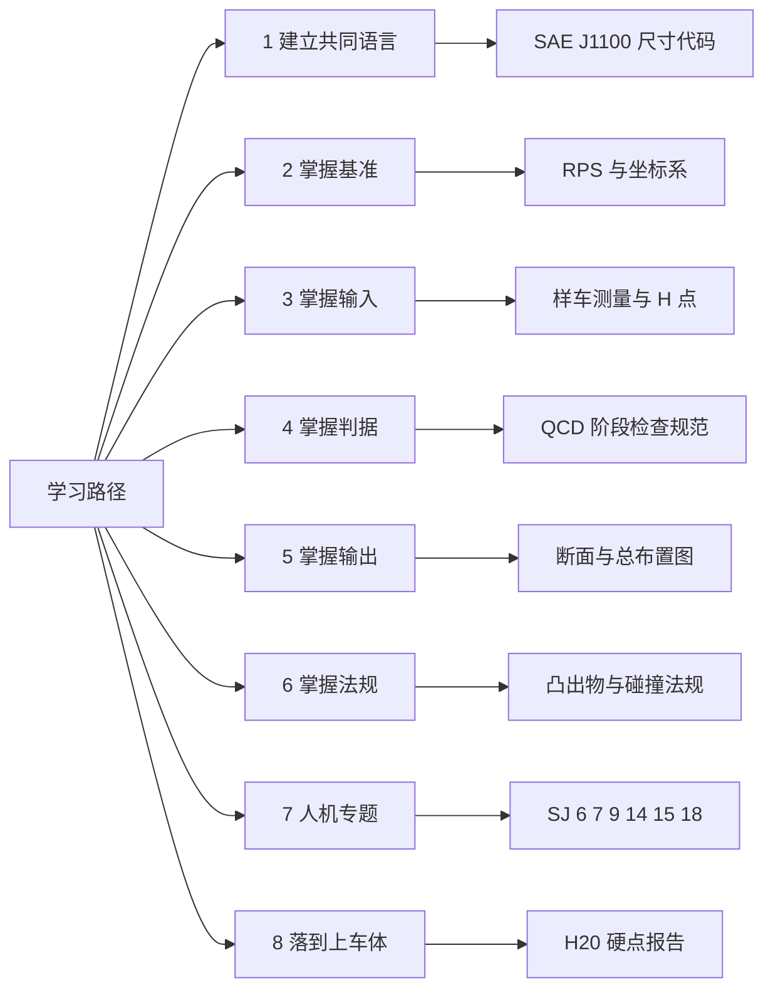

# 学习资源

!!! quote "内容来源"
    本页正文抽取自《总布置》知识库中**可文本解析**的文件：
    `40《总布置图设计规范》.xlsx`、`SAE-J1100机动车辆尺寸中文版总布置必学标准.pdf`（127 页）、
    `SJ 6/7/9/14/15/16/29/40/41/46/54` 各规范、`QCD-A0-005/006`、`EDD-A0-005-1/-2`。
    企业规范编号原样保留。

## 学习路径

## 概述

### 要点

**八步学习路径**（`上车体总布置基础.md` §5.4 给出的路径，已按本知识库的可读文件复核）：

| 步骤 | 目标 | 首选材料 |
|---|---|---|
| **1 建立"共同语言"** | 掌握尺寸代码 | `SAE J1100 机动车辆尺寸（中文版）`（**127 页，本知识库可完整解析**）+ `GB/T 19234 乘用车尺寸代码` |
| **2 掌握基准** | 坐标系与定位体系 | `SJ 29-2008 车身RPS设计指导书`；H20 硬点报告的"整车设计基准"四条定义 |
| **3 掌握输入** | 测量与 H 点 | `SJ 16-2008 样车总布置测量指导书`（四类测量 + 四张表） |
| **4 掌握判据** | 阶段检查规范 | `QCD-A0-005`（概念草图阶段）、`QCD-A0-006`（效果图阶段） |
| **5 掌握输出** | 断面的画法与表达 | `SJ 40-2009 外饰SEG断面`、`SJ 46-2009 仪表板SEG`（断面清单 + 设计思路） |
| **6 掌握法规** | 法规校核方法 | `SJ 44-2009 外部照明`、`SJ 39-2009 操纵件标志`、`SJ 54-2009 侧碰B柱断面系数` |
| **7 人机专题** | 人机四件套 | `SJ 6 人机硬点` → `SJ 9 眼椭球与头部包络面` → `SJ 15 手伸及界面` → `SJ 7 前方视野`（辅以 `SJ 14 后视镜`、`SJ 5 刮扫区域`、`SJ 18 顶篷`） |
| **8 落到上车体** | 用真实项目串起闭环 | `01-H20项目上车体结构设计构想` + `H20-整车总布置设计硬点报告`，串起"输入—对标—布置—校核—冻结" |

### 示例

第 1 步的材料是本知识库中**唯一一份完整可读的国际标准长篇**：

| 材料 | 体量 | 可解析性 |
|---|---|---|
| `SAE-J1100机动车辆尺寸中文版总布置必学标准.pdf` | **127 页** | **含文本层，可完整抽取（146 765 字符）** |
| `40《总布置图设计规范》.xlsx` | **127 项参数** | Excel，可完整解析 |

两者配合使用：`40` 给出**代码 + 中文名称 + 目标值**，SAE J1100 给出**代码的精确定义与测量方法**。

### 注意事项

- **版本与时效性甄别**：知识库中同一对象可能存在多个版本——`SAE J1100-2002` 与 `SAE J1100-2009`、
  `GB 7258-2004` 与 `GB 7258-2012`、`GB 11552-1999` 与 `GB 11552-2009`。
  学习中应以**最新版本**为准，但需注意**规范自身引用的版本可能较旧**（例如 `QCD-A0-005` 引用 `GB 7258-2004`，
  而 H20 硬点报告使用 `SAE J1100-2009`）；
- **知识库中的"经验值"要会分辨**：大量数值被标注为"经验值"或"仅供参考"，
  学习时应理解**取值背后的逻辑**（如 L1 = 1 mm 是为了保证密封条安装面边缘线始终是最外缘边），
  而非死记数值。

## 书籍与标准

### 要点

**（1）标准类（按优先级）**

| 优先级 | 材料 | 用途 |
|---|---|---|
| **P1** | **`SAE J1100` 机动车辆尺寸（中文版）** | 尺寸代码的唯一来源 |
| **P1** | **企业 SJ 系列（54 份）** | 每份都是"设计指导书 / 校核规范 / 流程"，含完整的方法与数值 |
| **P1** | **通用汽车 GM 系列（48 份）** | 人机与操作件的量化标准（U/T/Q/R/S/W/X 六类），英文但数值密度极高 |
| **P2** | `QCD-A0-005/006` | 阶段检查规范（门禁判据） |
| **P2** | `EDD-A0-005-1/-2` | 内外造型总布置检查清单（可直接当检查表用） |
| **P2** | `40《总布置图设计规范》` | 127 项参数目标表 |
| **P3** | `SAE J826`（H 点）、`SAE J287`（手伸及）、`SAE J941`（眼点）、`SAE J1052`（头部位置）、`SAE J1214`（轮胎间隙） | 单项方法的国际依据（知识库中以引用形式出现） |

**（2）项目报告类（真实数据的来源）**

| 材料 | 价值 |
|---|---|
| `H20-整车总布置设计硬点报告.docx` | **22 447 字符 + 8 张表**：整车设计基准、车身主要总成控制硬点、人机工程布置设计硬点 |
| `01-H20项目上车体结构设计构想.pptx` | 35 页 + **126 张内嵌图**：上车体结构设计的完整构想 |
| `H20-外轮廓尺寸，轴荷及质量限值，最小转弯直径校核报告.docx` | 外廓与质量校核实例 |
| `H20-方向盘布置报告`、`H20-操控件布置合理性分析报告`、`H20-雨刮刮刷面积校核报告` 等 `.docx` | 专项校核实例 |

**（3）对标数据类**

| 材料 | 内容 |
|---|---|
| `SJ 6-2008` 附录 A | 7 个车型的人机硬点坐标统计（轴距、H30、W20、APA、AHP/PRP/SgRP/SWC 坐标、转向盘角度） |
| `SJ 7-2008` 附录 A | 7 个车型的 A 柱障碍角、上下视野、转向盘障碍角 |
| `SJ 9-2008` 附录 A | 5 个车型的最小头部空间（W27/W35/H35/H61） |
| `SJ 54-2009` §5 | 丰田 COROLLA、海马 M2 的 B 柱断面系数算例 |
| `40《总布置图设计规范》` | 127 项参数的目标值（示例项目 A2A01） |

### 示例

**建议的学习顺序**（按"可读性 × 重要性"排）：

> `SAE J1100` 尺寸代码 → `QCD-A0-005/006`（判据）→ `SJ 6/9/15/7`（人机四件套）→
> `SJ 40/46`（断面方法）→ `SJ 18/20/21/24/47`（分系统设计指导书）→
> `SJ 29/41`（定位与流程）→ `H20 硬点报告 + 上车体构想`（真实项目闭环）

### 注意事项

- **英文材料的阅读成本 vs 收益**：GM 系列虽为英文，但每份只有 2～3 页，
  信息密度极高（如 `U02` 用一页给出按钮的尺寸、间距、位移、力值全部限值），**投入产出比优于中文长文**；
- **`.doc` 格式是主要障碍**：`ZBZ 标杆车报告`、`H20 系列的部分报告`、`整车部设计手册` 为旧版 `.doc`，
  **无法用 python-docx 解析**，需在 IMA 客户端中人工阅读。

## 在线课程与社区

!!! warning "待人工补充：知识库中未检索到对应内容"
    已检索关键词：`课程`、`教程`、`培训`、`论坛`、`社区`、`网课`（覆盖 SJ 全系列 54 份、GM 系列 48 份、
    QCD/EDD 规范、H20 项目报告），未命中在线学习资源的推荐。

    - **可用的替代素材**：《总布置》知识库的「汽车」文件夹中有 **91 篇【技研】系列微信文章**，
      覆盖汽车开闭件、密封条、内外饰工艺、注塑/搪塑工艺、白车身结构、NVH、热管理、悬架、轮胎、
      玻璃、保险杠、卡扣、尺寸链等主题；
    - **注意**：这些文章**多为纯图片型**（无文本层），需在 IMA 客户端或微信中阅读图片内容；
    - 建议补充：主机厂技术培训体系、SAE/中国汽车工程学会的公开资料、专业论坛的深度帖。

### 要点

- 现阶段可作为"图库 + 线索"使用的只有「汽车」文件夹的 91 篇技研文章，**不能作为可检索文本使用**。

### 注意事项

- **信息质量甄别**：微信文章多为科普与外文资料的编译，**不能作为设计判据**，
  需回到企业规范与国标核对后才能使用。

## 行业资讯

!!! warning "待人工补充：知识库中未检索到对应内容"
    已检索关键词：`行业报告`、`资讯`、`趋势`、`市场`，仅命中「汽车」文件夹中的
    《【报告】2025 年飞行汽车行业报告》《2025 新阶段智能汽车发展的战略思考》两篇（**均为纯图片型**）。

    - 与总布置直接相关的行业发展方向可从知识库内容侧面推断：
      - **模块化集成装配**：`SJ 50-2009` 指出现代汽车制造业采用的模块化集成装配方式
        "将是以后全球汽车设计业的发展方向"；
      - **电动车布置**：知识库中有 `AEM-A1-605+606 电动车布置流程`（因读取问题未采用）；
      - **设计工具自动化**：知识库根目录存在 `pycatia` 文件夹（CATIA 自动化脚本方向）。
    - 建议补充渠道：主机厂新车发布与技术日、行业展会（如北京/上海车展）、
      专业媒体与咨询机构的年度报告。

### 要点

- 已解析规范中唯一明确提到的行业趋势是**模块化集成装配**（`SJ 50-2009` §3.3）。

### 注意事项

- **避免信息过载**：总布置的核心知识更新速度**远慢于**资讯类内容，
  建议把学习精力优先投入到标准与规范（P1/P2 材料），资讯作为背景了解即可。

## 待人工补充

!!! warning "本页待人工补充清单"
    - **在线课程、论坛与社区**的具体推荐；
    - **行业资讯渠道**与跟踪机制；
    - **推荐书籍清单**：知识库中未出现教材/专著类文献（仅有标准、规范与项目报告）；
    - **`SAE J1100` 中文版正文的逐条释义**：文件已成功抽取（146 765 字符），
      本页仅将其列为 P1 材料，未展开代码定义内容（建议单独整理为"尺寸代码速查"）；
    - **`.doc` 格式材料的解析路径**：`ZBZ 标杆车报告`、`整车部设计手册` 等需人工阅读；
    - 知识库中以下文件虽相关但因读取问题**未采用**：`AEM-A0-005 概念草图阶段总布置工作手册`、
      `AEM-A0-200 总布置图绘制规范`、`AEM-A2-020 备胎布置分析`。

    建议：在 IMA 客户端中打开对应文件补充条款，或按"规范编号 + 页码"方式人工引用。

---

## 下一步阅读

- [软件工具](software.md)：CATIA、Ramsis 与数据协同
- [职业发展](career.md)：岗位方向与能力成长
- [法规与标准](../basics/standards.md)：标准体系与编码规则
- [断面设计方法](../sections/method.md)：断面表达规范
