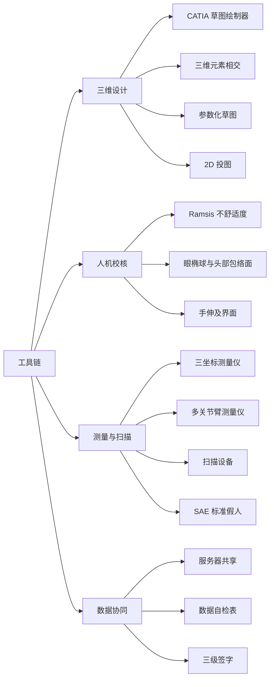

# 软件工具

!!! quote "内容来源"
    本页正文抽取自《总布置》知识库中**可文本解析**的文件：
    `SJ 46-2009 仪表板SEG分析设计指导书`、`SJ 9-2008 A类汽车眼椭球、头部包络面设计规范`、
    `SJ 40-2009 轿车外饰SEG分析断面设计指导书`、`SJ 16-2008 样车总布置测量指导书`、
    `QCD-A0-005 概念草图阶段总布置检查规范`、`SJ 41-2009 动力/底盘3D数据评审流程`、
    `SJ 4-2008 轿车车门主断面设计流程`、`SJ 29-2008 车身RPS设计指导书`。
    企业规范编号原样保留。

## 工具链

## 概述

### 要点

总布置工具链分四类，各自的定位如下：

| 类别 | 工具 | 主要用途 | 依据 |
|---|---|---|---|
| **三维设计** | **CATIA V5** | CAS/CLASS-A 数据、3D 断面、参数化草图、2D 投图 | `SJ 46-2009` §5.2、`SJ 40-2009` §5.2 |
| **人机校核** | **Ramsis** | 假人姿态模拟、操作舒适性（不舒适度）评价 | `QCD-A0-005` §4.3 |
| **测量与扫描** | 三坐标测量仪、多关节臂测量仪、扫描设备、SAE 标准假人 | 样车逆向测量 | `SJ 16-2008` §5.1.2 |
| **数据协同** | 企业服务器 + 评审文件体系 | 数据发布、评审、整改跟踪 | `SJ 41-2009` §5、§6 |

**（1）CATIA 在总布置中的四个典型用法**

| 用法 | 具体做法 | 依据 |
|---|---|---|
| **3D 断面绘制** | 统一在"**草图绘制器**"模块绘制，在打开默认约束的环境下用"**三维元素相交**"命令求得与 CAS 面或油泥模型外表面的交线，在此基础上做**参数化草图**断面设计 | `SJ 46-2009` §5.2 |
| **几何构造** | 建立眼椭球、头部包络面（`SJ 9-2008` §5.2 明确"运用 CATIA V5，通过上列设计方法建立眼椭球"）；生成手伸及界面（点云连面） | `SJ 9-2008`、`SJ 15-2008` |
| **坐标系与定位** | 零部件的绝对坐标系与整车坐标系重合；RPS 点标注 | H20 硬点报告、`SJ 29-2008` |
| **2D 投图** | 3D 数据须"与整车比例相同，并可用于进行 2D 投图"；2D 断面比例优先 1:1 | `SJ 41-2009` §3.1、`SJ 40-2009` §5 |

**（2）参数化草图的三个优点**（`SJ 46-2009` §5.2）

① **绘图快捷**；② **编辑修改方便**；③ **可做运动件草图模拟分析**。

**（3）测量设备的完整清单**（`SJ 16-2008` §5.1.2）

| 设备/工具 | 数量 | 用途 |
|---|---|---|
| 三坐标测量仪 | 1 台 | 主测量设备 |
| 多关节臂测量仪 | 1 台 | 与 SAE 人体配合测量人机硬点 |
| 扫描设备 | 1 台 | 特征线与外形扫描 |
| **SAE 标准假人** | 1 个 | 确定 H 点、坐姿、人机尺寸 |
| 人体配重（68 + 7）kg | 视车型而定 | 模拟乘员载荷 |
| 千斤顶 | 4 个 | 调平车身至设计姿态 |
| 刮刀 / 有机溶剂 | 各 1 | 去除钣金表面涂胶（基准孔与姿态指示点） |
| 卷尺 / 直尺 | 各 1 | 辅助尺寸 |
| 标记笔（3 色）/ 胶带 | 若干 | 基准点与姿态点标记与保护 |
| 拆车工具 / 抹布 / 手套 | 若干 | 拆车与清洁 |

### 示例

CATIA 断面设计的标准动作链（`SJ 46-2009` §5.2）：

> 打开"草图绘制器"模块 → 保持默认约束环境 → 用"三维元素相交"命令求与 CAS 面/油泥模型外表面的**交线** → 在交线基础上做**参数化草图**断面设计 → 用于后续 2D 投图与结构设计。

### 注意事项

- **版本兼容与数据交换属待人工补充项**：已解析条款未涉及 CATIA 版本管理、跨企业数据交换格式（如 STEP/JT）的规定；
- **数据格式有硬要求**：3D 数据定义为"**整车坐标系下**，由 CATIA 软件建立的，**与整车比例相同**的，并可用于进行 2D 投图的三维数据"（`SJ 41-2009` §3.1）——比例不一致的数据不能作为交付物。

## 三维设计软件

### 要点

**（1）CATIA 在断面设计中的角色**（`SJ 40-2009` §5、`SJ 46-2009` §5）

| 环节 | 要求 |
|---|---|
| **3D 断面** | 统一在"草图绘制器"模块绘制；用"三维元素相交"命令求交线；做参数化草图 |
| **2D 断面** | 统一模板；标题栏体现断面在车身中的位置图、断面面积、转动惯量、断面编号、名称、比例；明细栏体现序号、**英文名称**、料厚 |
| **比例** | 优先 **1:1**，其次 1:2、2:1（外饰 SEG）；仪表板 SEG 为 1:1 优先，其次 1:2、1:5、2:1 |
| **图幅** | 建议 A2（分布图与大断面）与 A3（其余） |
| **线型与字体** | 尺寸标注用 SSS1 字体、字号 3.5；基准线与孔中心线用 4 号单点划线；假想示意线用 5 号双点划线；孔的连接线用 2 号虚线；断面线及标注用 1 号细线；涂胶用 Hatching/45°/Pitch 1mm/Offset 0 |

**（2）软件能力还体现在"基准的可操作性"上**（`SJ 40-2009` §6）

断面基准通常包括：**坐标平面**、**CAS 面（BODY CONTOUR）**、**各件分缝线**，
再加专项基准（人体、组合仪表、转向管柱、方向盘布置等）。**基准必须在软件中可被稳定引用**，
否则下游结构设计无法直接使用。

**（3）另一类"软件"是标准人体模型**（`SJ 45-2009` §3、`SJ 16-2008`）

- **E.O 点**（Ergosphere Origin）：可通过大致的球面表示驾驶员手的操作范围，其中心称为 E.O 点；
- 人体模型库需覆盖 **SAE 95% / 50% / 5%** 百分位（`SJ 15-2008` 手伸及界面需 95/50/5%；
  `QCD-A0-005` 前方视野按 SAE 95%、后排降级至 50%/5% 女性假人）。

### 示例

CATIA 中的"设计状态"处理方式（H20 硬点报告）：布置时**车身放平（前纵梁平直部分水平）并作为不动基准**，
车轮位置由**悬架状态拟合出不同地面**，从而得到各载荷状态的整车姿态——
这说明三维模型中的**基准选择直接影响多状态计算的可行性**。

### 注意事项

- **数据交付前的检查依赖软件能力**：`SJ 41-2009` 要求的配接单、管线布置校核报告、动态检查报告，
  都需要在 CATIA 环境中完成干涉与运动检查；
- **"英文命名"是规范要求而非个人偏好**：`SJ 46-2009` §5 与 `SJ 40-2009` §5 都建议/要求采用英文命名与标注，
  目的是与国际接轨并便于外籍专家审核。

## 人机校核工具

### 要点

**（1）Ramsis 的定位与用法**（`QCD-A0-005` §4.3）

| 项目 | 内容 |
|---|---|
| 用途 | 模拟空间操作校核——比"包络落在界面内"更合理的校核方式 |
| 校核对象 | **换挡手柄**与**手刹**（驾驶员操作最频繁的手操纵件之一） |
| 假人覆盖 | **95%、50%、5%** 三个百分位，在各自的 H 点位置 |
| 输出 | **不舒适度值** |
| 判据 | 与**竞争车型的不舒适度值对比**，据此判断差异并作出改进 |

> 通俗做法是"要求换挡手柄包络与手刹包络必须落在驾驶员手握式手伸及界面之内"；
> 更合理的做法是用 Ramsis 得出不舒适度值并与竞品对比。

**（2）人机校核的几何工具（可脱离 Ramsis 完成）**

| 工具 | 生成方法 | 依据 |
|---|---|---|
| **眼椭球** | 按 TL1 选轴长 → 侧视图 β = 12° 倾角 → 按公式定位中心点 | `SJ 9-2008` §5.2 |
| **头部包络面** | 按 TL23 与百分位选轴长 → 可调座椅有 12° 倾角、固定座椅无倾角 → 按公式定位中心点 | `SJ 9-2008` §6.2 |
| **手伸及界面** | 算 G 因子 → 定参考坐标系（HR = 786 − 99G）→ 选 SAE J287 表格 → 点云连成面 | `SJ 15-2008` §5 |
| **A/B/C 区** | 由 V1、V2 点与规定角度作平面，与风窗玻璃外表面相交 | `SJ 5-2009` §5.2、§5.3 |

**（3）人体模型库的选择**（`SJ 16-2008` §5.1.2）

样车测量需使用 **SAE 标准假人**并配 **人体配重（68 + 7）kg**——68 kg 对应标准人体质量、
7 kg 为附加配重，用于模拟真实乘员载荷。

### 示例

Ramsis 校核的完整流程：**输入 H 点与人体模型 → 设定手操纵件位置与包络 → 模拟操作动作 → 输出不舒适度值 → 与竞品对比 → 改进布置或调整硬点**。

### 注意事项

- **人体模型库的选择直接决定结论**：`SJ 9-2008` §5.1 说明 SAE 眼椭圆基于**北美人群** 2300 多名驾驶员的
  统计测定——用于其他市场时需谨慎；项目若有目标市场人体数据应优先采用；
- **不舒适度是相对指标**：没有竞品基准时应改用绝对姿态角范围与手伸及界面双重判据。

## 数据管理与协同

### 要点

**（1）数据交付的检查体系**（`SJ 41-2009` §5）

| 文件 | 作用 | 签署要求 |
|---|---|---|
| **3D 数据自检表** | 按规定的项目对 3D 数据进行检查 | 设计人员**自检** → 主管领导**校对** → 部门领导**审核**（**纸版三级签字**），电子版汇总存放服务器 |
| **系统配接单** | 各系统接口确认 | 各级签字确认 |
| **管线布置校核报告** | 管路布置合理性分析 | 责任人填写，通知各系统负责人整改 |
| **动态检查报告** | 运动件合理性分析 | 同上 |
| **整改开闭项清单** | **跟踪**各检查报告中的调整内容是否已完成修改 | 同上 |
| **评审报告 PPT** | 评审内容与目的介绍 | 项目负责人编制，**评审前三天完成** |

**（2）数据发布与协同流程**（`SJ 41-2009` §6）

1. 确定评审日期后，**提前三天**将评审准备内容放到指定服务器，供与会专家察看数据；
2. 评审开始后，项目负责人介绍评审报告，各项检查报告负责人介绍检查内容及**整改结果**；
   其间安排**专人记录**专家问题并填写《评审报告》；
3. 会后由专人整理问题填写《整改记录》，**合格后**进行数据交付。

**（3）RPS 作为跨环节的数据基准**（`SJ 29-2008`）

RPS 点是**模具、工装、检具的共同定位点**，必须保证"模具、工装、检测工具都按照 RPS 点来制造"——
这在数据管理上意味着：**RPS 点是数据版本之间的稳定锚点**。

### 示例

数据协同的最短闭环：**数据自检（三级签字）→ 放服务器 → 评审（专人记录）→ 整改记录 → 合格后交付**。
其关键设计是"**问题必须被记录并跟踪关闭**"——`SJ 41-2009` 的整改开闭项清单就是为此存在。

### 注意事项

- **权限与版本管理要点属待人工补充项**：知识库中未见 PLM 系统的具体配置、权限分级与版本命名规则
  （仅出现"电子版汇总存放于服务器"这类描述）；
- **纸版与电子版并存不是冗余**：自检表要求纸版签字 + 电子版汇总，前者承载**责任**、后者承载**检索与追溯**；
- **"提前三天"贯穿全流程**：不仅评审准备文件，评审报告 PPT 也需提前三天完成——
  **准备时间本身是流程的一部分**。

## 待人工补充

!!! warning "本页待人工补充清单"
    - **CATIA 版本管理与跨企业数据交换格式**（STEP / JT 等）；
    - **PLM 系统的权限分级、版本命名规则与数据发布审批流程**；
    - **Ramsis 的详细操作方法**（模型导入、约束设置、不舒适度计算方法）：知识库中仅有引用；
      「汽车」文件夹中的《CATIA 玻璃面拟合从 0 到 1 实战全流程》为**纯图片型微信文章**，无法提取文本；
    - **`pycatia` 相关工具**：《总布置》知识库根目录存在 `pycatia` 文件夹，
      内容为 CATIA 自动化脚本相关，本页未展开；
    - **办公与文档工具**（Excel/PPT 模板在企业标准中的规范）：`SJ 41-2009` 附录 A 给出评审报告 PPT 的
      11 页结构，但未见模板文件本身；
    - 知识库中以下文件虽相关但因读取问题**未采用**：`AEM-A0-200 总布置图绘制规范`、
      `AEM-A0-203 造型用总布置图制作`。

    建议：在 IMA 客户端中打开对应文件补充条款，或按"规范编号 + 页码"方式人工引用。

---

## 下一步阅读

- [学习资源](learning.md)：标准与规范的学习路径
- [职业发展](career.md)：岗位方向与能力发展
- [断面设计方法](../sections/method.md)：断面表达规范与线型要求
- [工程师职责](../basics/responsibilities.md)：三级签字与评审职责
