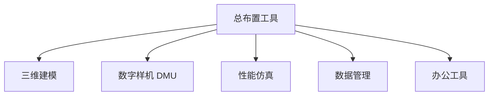
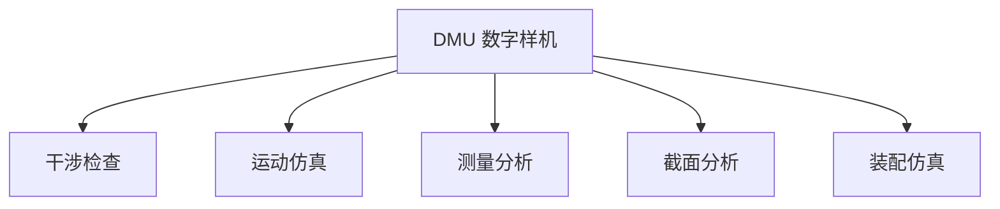
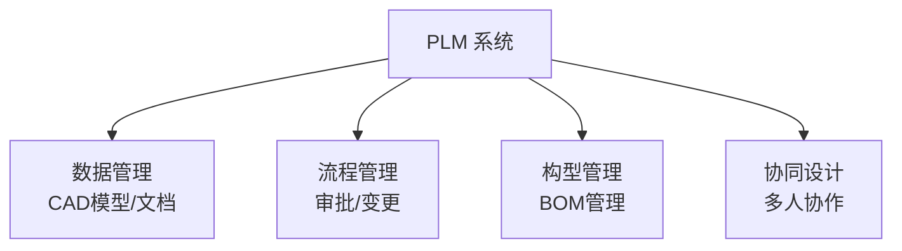
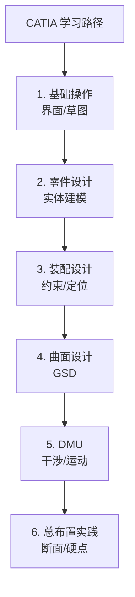

# 软件工具

## 概述

汽车总布置工程师需要掌握多种软件工具，涵盖三维建模、数字样机、性能仿真、数据管理等。本章介绍常用工具及其使用场景。

## 工具分类



## 三维建模软件

### CATIA（最主流）

| 项目 | 说明 |
|------|------|
| 厂商 | 达索系统（Dassault Systèmes） |
| 应用 | 汽车主流建模软件 |
| 特点 | 参数化建模、曲面能力强 |
| 模块 | Part Design、Assembly、Generative Shape Design、DMU |

```
CATIA 主要模块：
├── 零件设计（Part Design）
├── 装配设计（Assembly Design）
├── 曲面设计（GSD）
├── 钣金设计（Sheet Metal）
├── 运动仿真（DMU Kinematics）
├── 空间分析（DMU Space Analysis）
└── 人机工程（Human Modeling）
```

!!! tip "CATIA 总布置常用功能"
    - **断面绘制**：在 2D 断面中进行初步布置
    - **装配约束**：定位各总成
    - **DMU 干涉检查**：检查零件干涉
    - **运动仿真**：悬架跳动、转向转动
    - **硬点发布**：发布硬点供各系统引用

### NX（Siemens）

| 项目 | 说明 |
|------|------|
| 厂商 | 西门子 |
| 应用 | 部分主机厂使用（如通用、部分自主品牌） |
| 特点 | 集成 CAD/CAE/CAM |

### Creo（PTC）

| 项目 | 说明 |
|------|------|
| 厂商 | PTC |
| 应用 | 部分企业使用 |

## 数字样机（DMU）

### DMU 功能



| 功能 | 说明 |
|------|------|
| 干涉检查 | 检查零件间碰撞，输出干涉报告 |
| 运动仿真 | 模拟运动件（悬架、转向、车门） |
| 测量 | 测量间隙、距离、角度 |
| 截面 | 任意切截面分析 |
| 装配仿真 | 模拟装配路径，检查可装配性 |

### 干涉检查流程

```
1. 定义检查范围（哪些零件参与）
2. 定义检查工况（静态/动态）
3. 运行干涉检查
4. 分析干涉结果
5. 输出干涉报告
6. 跟踪关闭干涉
```

!!! warning "干涉检查的重要性"
    总布置必须定期（每周/每两周）进行 DMU 干涉检查，
    发现问题越早，整改成本越低。

## 性能仿真软件

### 动力学仿真

| 软件 | 厂商 | 应用 |
|------|------|------|
| CarSim | Mechanical Simulation | 整车动力学仿真 |
| Adams | MSC | 多体动力学 |
| veDYNA | TESIS | 动力学仿真 |

### CAE 仿真

| 软件 | 用途 |
|------|------|
| ANSYS | 结构/流体/热分析 |
| Abaqus | 非线性结构分析 |
| LS-DYNA | 碰撞仿真 |
| Star-CCM+ | CFD 流体仿真（风阻、热管理） |
| Hypermesh | 前处理网格划分 |

### NVH 仿真

| 软件 | 用途 |
|------|------|
| LMS Virtual.Lab | NVH 分析 |
| Actran | 声学分析 |

## 数据管理软件

### PLM 系统

| 系统 | 厂商 | 说明 |
|------|------|------|
| Teamcenter | Siemens | 主流 PLM |
| ENOVIA | Dassault | 与 CATIA 集成 |
| Windchill | PTC | 与 Creo 集成 |



### PLM 在总布置中的作用

| 功能 | 说明 |
|------|------|
| 数据统一管理 | 所有 CAD 数据集中存储 |
| 版本控制 | 设计变更可追溯 |
| 变更管理 | ECN 流程管理 |
| 权限控制 | 不同角色不同权限 |
| 协同设计 | 多人同时开发 |

## 人机工程软件

| 软件 | 功能 |
|------|------|
| CATIA Human Modeling | 人体模型、视野分析 |
| Jack | 人机工程分析 |
| RAMSIS | 人体模型（德国） |

```
人机工程分析内容：
├── 视野分析（眼椭圆）
├── 可达性分析（手伸及面）
├── 舒适性评估（RULA）
├── 力量分析
└── 上下车模拟
```

## 办公与辅助工具

| 工具 | 用途 |
|------|------|
| Excel | 参数表、硬点表、质量表 |
| PowerPoint | 方案汇报 |
| Word | 报告撰写 |
| Visio | 流程图绘制 |
| Python | 数据处理、自动化 |

!!! tip "Python 在总布置中的应用"
    - 批量处理硬点表
    - 自动生成干涉报告
    - 参数计算（轴荷、质心）
    - 数据可视化
    - 与 CATIA 自动化交互（CAA/Python 接口）

## 工具选择建议

### 学生/初学者

| 阶段 | 工具 | 说明 |
|------|------|------|
| 入门 | CATIA 基础 | 掌握建模和装配 |
| 进阶 | DMU | 学习干涉检查 |
| 补充 | Excel | 参数管理 |
| 拓展 | Python | 自动化能力 |

### 工作中

| 优先级 | 工具 |
|--------|------|
| 必备 | CATIA + DMU |
| 必备 | PLM（Teamcenter/ENOVIA） |
| 必备 | Excel |
| 推荐 | 性能仿真（CarSim/Adams） |
| 加分 | Python |

## 学习资源

### CATIA 学习

| 资源 | 说明 |
|------|------|
| 官方文档 | 最权威 |
| 视频教程 | B站/YouTube |
| 练习模型 | 从简单零件开始 |
| 企业培训 | 入职培训 |

### 自学建议



!!! tip "快速提升建议"
    1. **多练**：每天画 2-3 小时
    2. **看车**：找竞品车数模研究布置
    3. **模仿**：临摹优秀布置方案
    4. **总结**：建立自己的模板和技巧库

## 工具对比总结

| 工具类型 | 首选 | 备选 |
|----------|------|------|
| 三维建模 | CATIA | NX / Creo |
| DMU | CATIA DMU | NX Motion |
| 动力学 | CarSim | Adams |
| CAE | ANSYS | Abaqus |
| PLM | Teamcenter | ENOVIA |
| 人机 | CATIA HMA | Jack/RAMSIS |

---

## 下一步阅读

- [学习资源](learning.md）：书籍与课程推荐
- [职业发展](career.md）：工具能力与职业路径
- [总布置基础](../basics/responsibilities.md）：工程师能力要求
